# Lab 3 — Interception du Trafic Android via Burp Suite

## Objectif

Intercepter et analyser le trafic HTTP/HTTPS d'un émulateur Android en utilisant Burp Suite Community comme proxy MITM. Inclut l'installation du certificat CA de Burp pour déchiffrer le trafic HTTPS.

---

## Prérequis

| Composant | Détail |
|---|---|
| **Burp Suite Community** | Installé sur la machine hôte |
| **Android Studio** | Émulateur Pixel / Nexus (API 28 recommandée) |
| **ADB** | Accessible depuis le terminal hôte |
| **Réseau de labo** | Environnement isolé ou réseau local dédié |
| **Cible** | Application/site de test autorisé |

> **Avertissement légal** : Ce lab doit être réalisé uniquement sur des cibles autorisées dans un environnement isolé. Toute interception non autorisée est illégale.

---

## Architecture du Lab

```
┌──────────────────────┐         ┌──────────────────────┐
│    Machine Hôte       │         │   Émulateur Android   │
│                      │         │                      │
│  Burp Suite Proxy    │◄───────►│  Proxy → 10.0.2.2    │
│  127.0.0.1:8080      │  MITM   │         :8080        │
└──────────────────────┘         └──────────────────────┘
          │
          ▼
    Cible autorisée
```

---

## Étapes du Lab

### Étape 1 — Configurer le Listener Burp Suite

1. Ouvrir Burp Suite → **Proxy** → **Proxy settings**
2. Vérifier listener actif sur `127.0.0.1:8080`
3. S'assurer que **"Running"** est coché

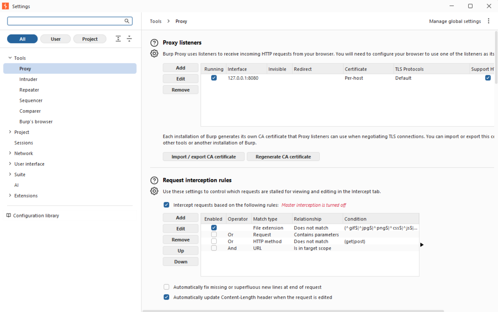

---

### Étape 2 — Configurer le Proxy sur l'Émulateur Android

1. Démarrer l'émulateur dans Android Studio
2. **Settings** → **Wi-Fi** → Maintenir appui sur `AndroidWifi` → **Modify Network**
3. **Advanced options** → **Proxy : Manual**
   - Hostname : `10.0.2.2` *(IP hôte vue depuis l'émulateur)*
   - Port : `8080`
4. **Save**

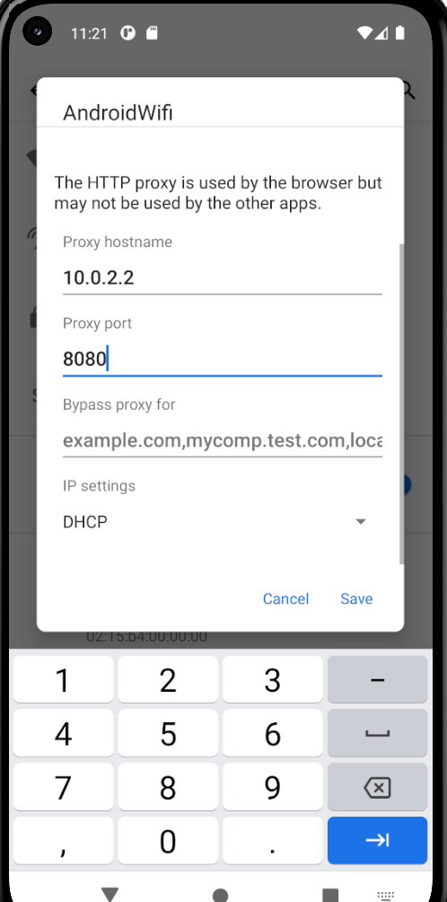

---

### Étape 3 — Vérification : Erreur SSL (avant installation du certificat)

À ce stade, le trafic HTTP est intercepté mais le HTTPS échoue avec :

```
NET::ERR_CERT_AUTHORITY_INVALID
```

Le navigateur Android rejette le certificat auto-signé de Burp car il n'est pas encore installé comme CA de confiance.

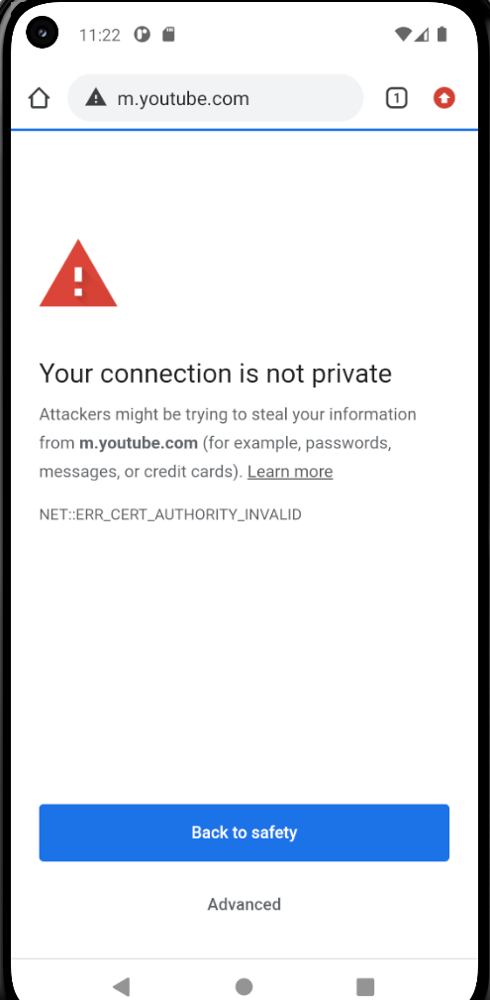

---

### Étape 4 — Interception du Trafic HTTP

Malgré l'erreur HTTPS, le trafic HTTP est déjà visible dans Burp Suite → **Proxy** → **HTTP history**.

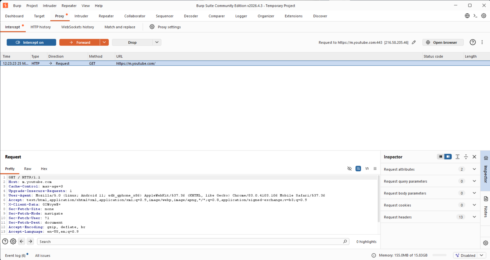

Détail d'une requête/réponse complète :

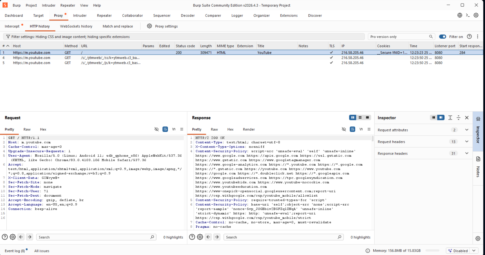

---

### Étape 5 — Pousser le Certificat Burp via ADB

Depuis PowerShell / terminal hôte :

```powershell
cd .\lab3_sec\
adb push .\burpcert.crt /sdcard
adb shell
```

Depuis le shell ADB :

```sh
mv /sdcard/burpcert.crt /sdcard/Download/
```

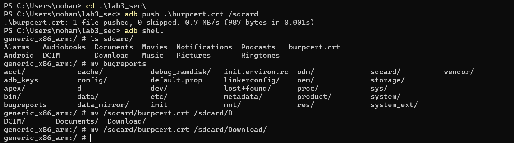

> `10.0.2.2` est l'alias Android Studio pour `localhost` de la machine hôte. Le certificat est déposé dans `/sdcard/Download/` pour être accessible depuis les paramètres Android.

---

### Étape 6 — Installer le Certificat sur Android

1. **Settings** → **Security** → **Encryption & credentials**
2. **Install a certificate** → **CA certificate**

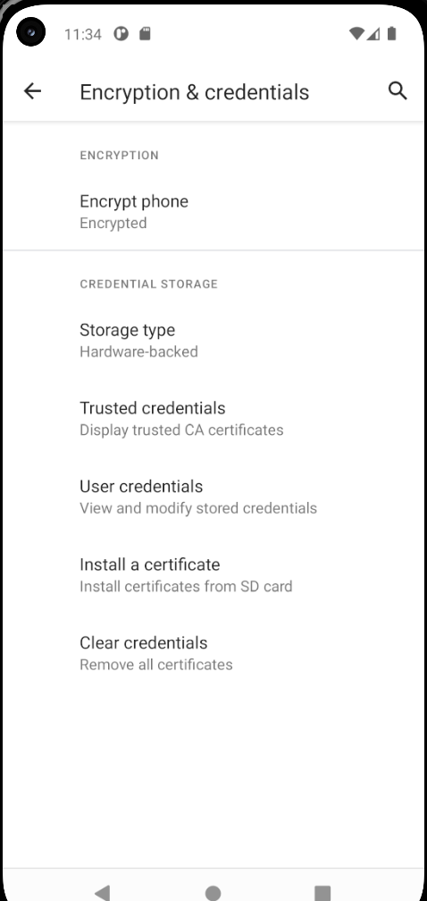

3. Naviguer vers **Downloads** → sélectionner `burpcert.crt`

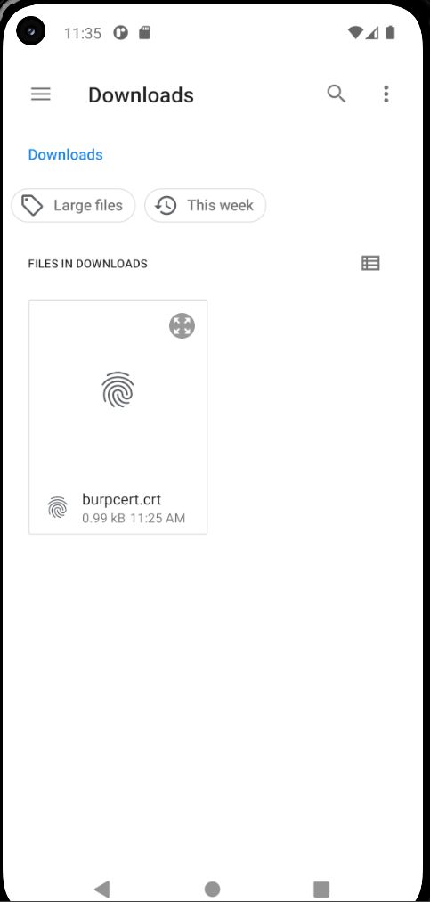

4. Confirmer l'installation — vérifier les détails du certificat PortSwigger CA

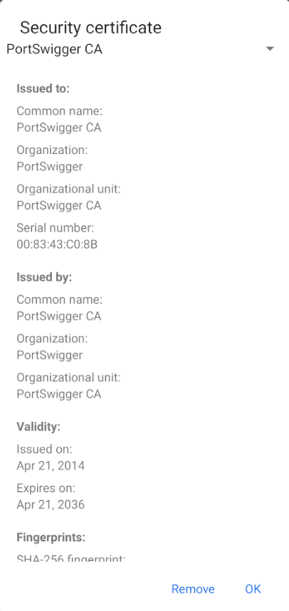

---

### Étape 7 — Interception HTTPS Fonctionnelle

Après installation du certificat, le trafic HTTPS est déchiffré et visible dans Burp Suite.

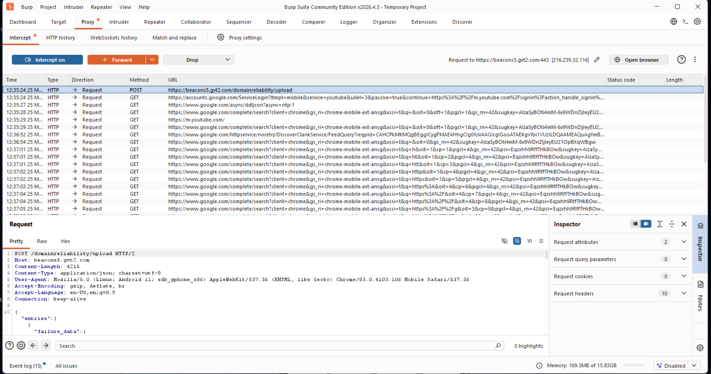

---

### Étape 8 — Résultat Final : Intercept Live

Burp Suite intercepte en temps réel les requêtes HTTPS de l'émulateur (ici `google.com`).

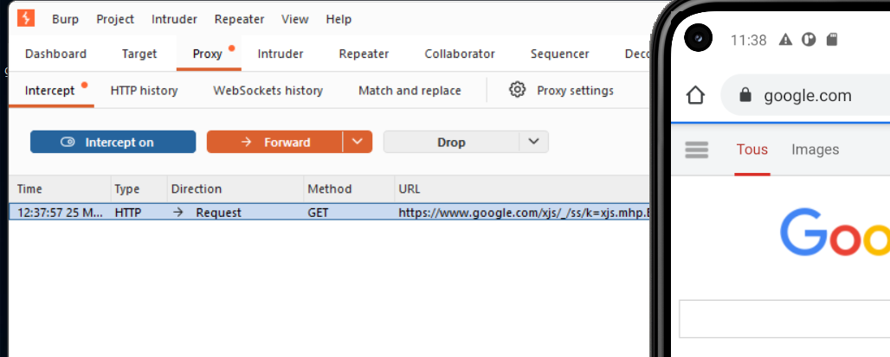

L'émulateur affiche `google.com` avec le cadenas HTTPS valide — le trafic passe bien par Burp de manière transparente.

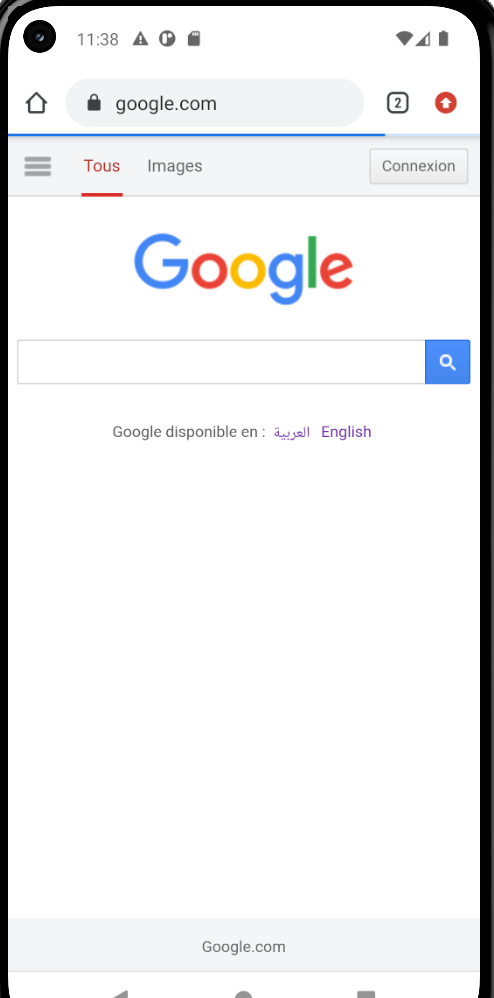

---

## Résultats Attendus

| Étape | Résultat |
|---|---|
| Proxy configuré, certificat absent | HTTP intercepté, HTTPS bloque avec `ERR_CERT_AUTHORITY_INVALID` |
| Certificat Burp installé | HTTP + HTTPS interceptés et déchiffrés |
| Intercept actif | Modification des requêtes en temps réel possible |

---

## Dépannage

| Problème | Solution |
|---|---|
| Trafic non intercepté | Vérifier proxy `10.0.2.2:8080` sur l'émulateur |
| `ERR_CERT_AUTHORITY_INVALID` persistant | Certificat non installé ou installé en tant que "user cert" → recommencer étape 6 |
| `adb` non trouvé | Ajouter Android SDK platform-tools au PATH |
| API 29+ bloque cert utilisateur | Utiliser émulateur API ≤ 28 ou modifier `network_security_config.xml` |
| Émulateur ne joint pas le proxy | Utiliser `10.0.2.2` (jamais `localhost` ni `127.0.0.1` depuis l'émulateur) |

---

## Structure du Dépôt

```
lab3_sec/
├── README.md
└── screens/
    ├── 01_burp_proxy_listener.png
    ├── 02_android_proxy_config.png
    ├── 03_ssl_error_no_cert.png
    ├── 04_burp_http_history.png
    ├── 05_burp_http_request_response.png
    ├── 06_adb_push_cert.png
    ├── 07_android_cert_menu.png
    ├── 08_android_cert_downloads.png
    ├── 09_portswigger_ca_details.png
    ├── 10_burp_https_history.png
    ├── 11_burp_intercept_live.png
    └── 12_android_https_success.png
```

---

## Références

- [Burp Suite Docs — Installing CA Certificate on Android](https://portswigger.net/burp/documentation/desktop/mobile-testing/configuring-an-android-device-to-work-with-burp)
- [Android Emulator Networking — 10.0.2.2](https://developer.android.com/studio/run/emulator-networking)
- [ADB — Android Debug Bridge](https://developer.android.com/tools/adb)
